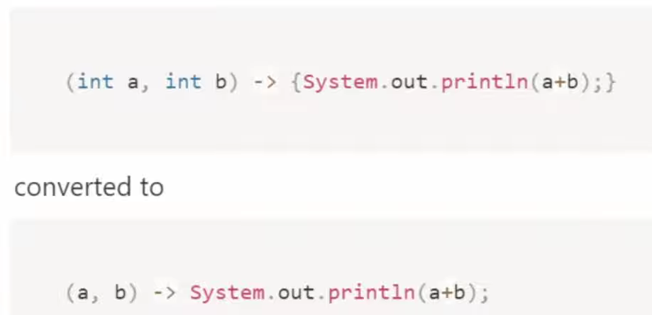
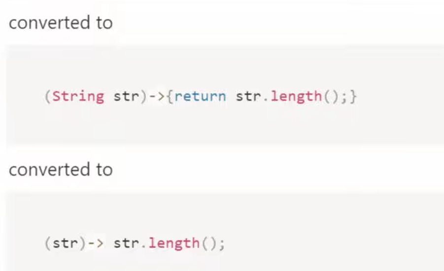
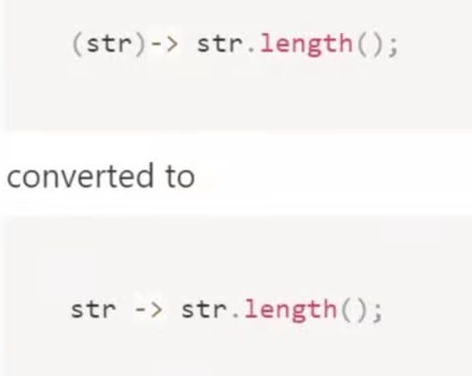
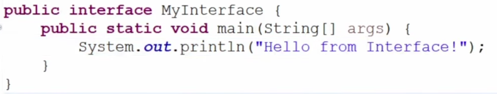
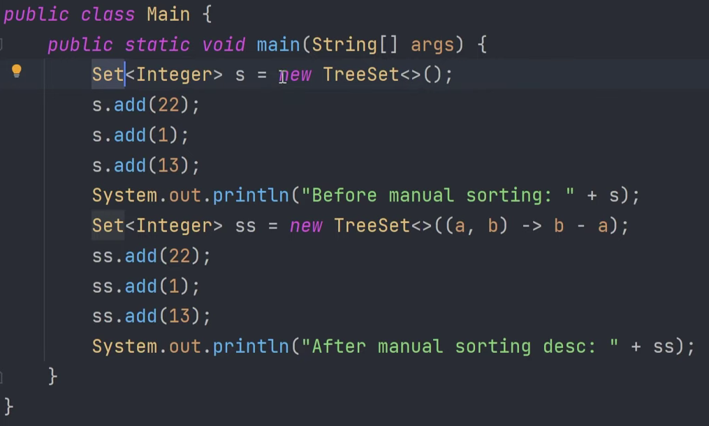
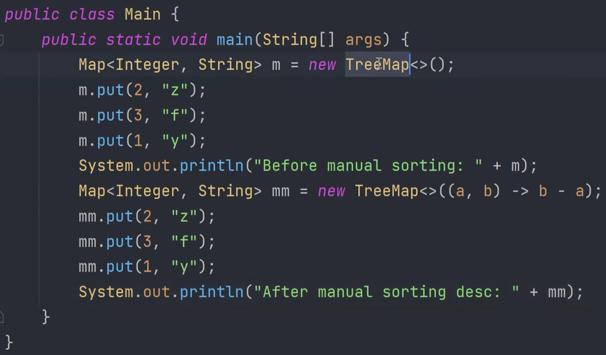

# Java 8

- Features -> Lambda Expression, Stream API, Date and Time API, Base64 encode decode, Method Reference, Constructor Reference, Default Methods and Static Methods in Interfaces, Functional Interfaces(SAM), Functional Class, Java I/O improvements, Collection API Improvements.

## Lmbda expression:
- Is an anonymous function  
- not having any name
- Not having any return type
- Not having modifier.

- if one statement remove curly brackets. 
- use type inference. 
- no return keyword. 
- If only one param remove small brackets. 

## Functional Interface

- Have exactly single abstract method
- @Funtional Interface {see File2}
- Act as a type for Lmbda expression. ( like int a = 2);
- Inheritance in Function Interface {see parent.java child.java}

## Default Methods

- Methods with body is default methods. {File3}
- Example {see file4}

## Static Methods

- static methods in Interface are those methods, which are defined in the interface with static keyword.
- contains the complete definition of the function
- cannot be overridden or changed in the implementation class.
- can be called using interface name. {see file5} 
- Implementation class doesnt able to access the static method.

- NOTE: we can write main method inside Interface.

## Use of Lmbda Expression

- Interface reference can be used to hold lambda expression.
- Using lmbda expression, we dont need to use any separate implementation class. {file 6}

## Thread using lambda expression

- file 7

## Comparator

- file 8
- for TreeSets: 
- for TreeMap: 
- for objects: 

## Predicates: AND, OR and isEqual

- It only checks the condition, .test()

- Predicate: boolean Valued Function, .test()
- file9
- And, or, negate, isEqual  : File9

## Funtion

- It does the work, .apply()

- Its functional Interface, takes argument, return -{file90}
- function chaining: andThen(), compose() - {file91}
- Identity(): static method

## Consumer

- function Interface
- accept(), andThen()  file92 

## Supplier

- only one method: get   file92

## BiPridicate, BiFunction, BiConsumer

- BiPredicate - and, or, negate
- BiFunction - andThen()
- BiConsuner - andThen() - file93

## Unary, Binary operator

- Unary: Its special case of Function - file94 
- where if we have same data type in input, output, so dont need to write twice.

- Binary: use 1 instead of two.

## Method Reference

- use method without invoking & in-place of lambda expression
- (File95)

## Streams

- Introduced in Java8
- process collections of data in a functional and declarative manner
- simplify data processing, embrace functional programming, enable easy parallelism

- ways to use stream: source -> intermediate -> terminal operations

- Ways to create Stream - FileX1
- Intermediate operations - FileX2_1
- terminal operations - FileX2_2
- Overall operations - FileX2

## Parallel Stream 

- A type of Stream that enables parallel processing of elements  {FileX3}
- Allowing multiple threads to process parts of the stream simultaneously
- This can significantly improved performance for large data sets
- workload is distributed across multiple threads.

## Collectors

- FileX4
- Collectors is utility class
- provides a set of methods to create common collectors

## Practise:  
- Collectors :FileX5

## Primitives Stream

- FileX6

## Date & Time API  

- LocalDate: represents a date without a time zone - FileX7
- LocalTime: represents a time
- LocalDateTime
- ZonedDateTime: Represents a data and time with a time zone.
- Instant: 
- Duration: represents a duration of time between two points in time.
  we use duration when we go for hrs, min, sec. for months, Years we use Period

- Period: 
- Date time formatter
 